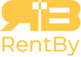

# RentBy Backend ML



This repository contains a Product Recommendation with Machine Learning API built using Python and Flask. It is deployed using Google Cloud service that is App Engine. This guide will help you get started with setting up, running, and deploying the application.


## Table of Contents

- [Prequisites](#prequisites)
- [Libraries](#libraries)
- [Installation](#installation)
- [Runing the Application](#runing-the-application)
- [Deployment](#deployment)

## Prequisites

- [Python 3.9](https://www.python.org/)
- [Flask](https://flask.palletsprojects.com/en/3.0.x/)
- [Git](https://git-scm.com/)
- [Google Cloud SDK](https://cloud.google.com/sdk?hl=en)


## Libraries
These are main libraries that are used to create the backend service
- [Tensorflow](https://www.tensorflow.org/)
- [Scikit Learn](https://scikit-learn.org/)
- [Pandas](https://pandas.pydata.org/)

## Installation
To get a local copy up and running, follow these steps:

1. Clone the repository:
    ```sh
    git clone https://github.com/Rentby/rentby-backend-ml.git
    ```

2. Install Dependencies
     ```sh
    python3 -m venv venv
    source venv/bin/activate
    pip install -r requirements.txt
    ```

## Runing the Application
1. Start the application:
    ```sh
    python3 main.py
    ```

## Deployment
App Engine

1. Deploy to App Engine
    ```sh
    gcloud app deploy
    ```
   

<p align="center">
    Made by the RentBy Team
</p>
